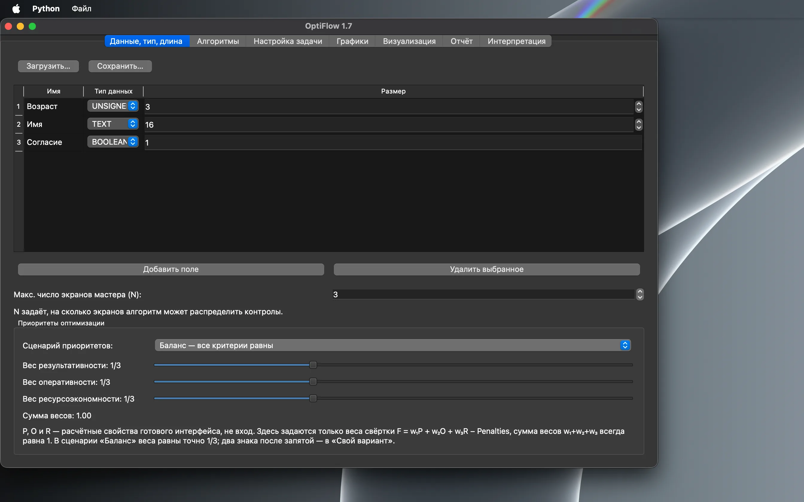
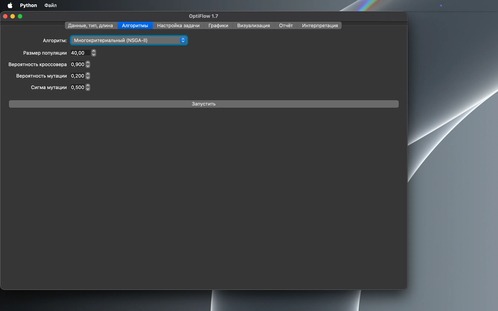
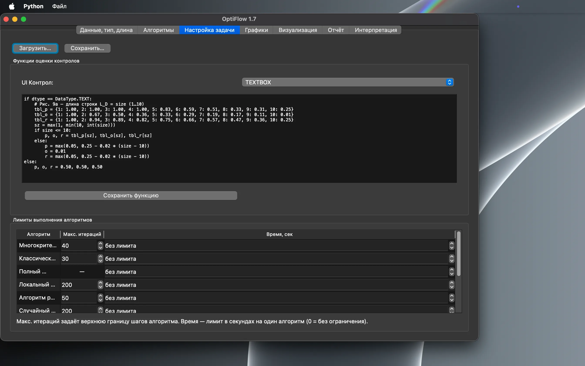
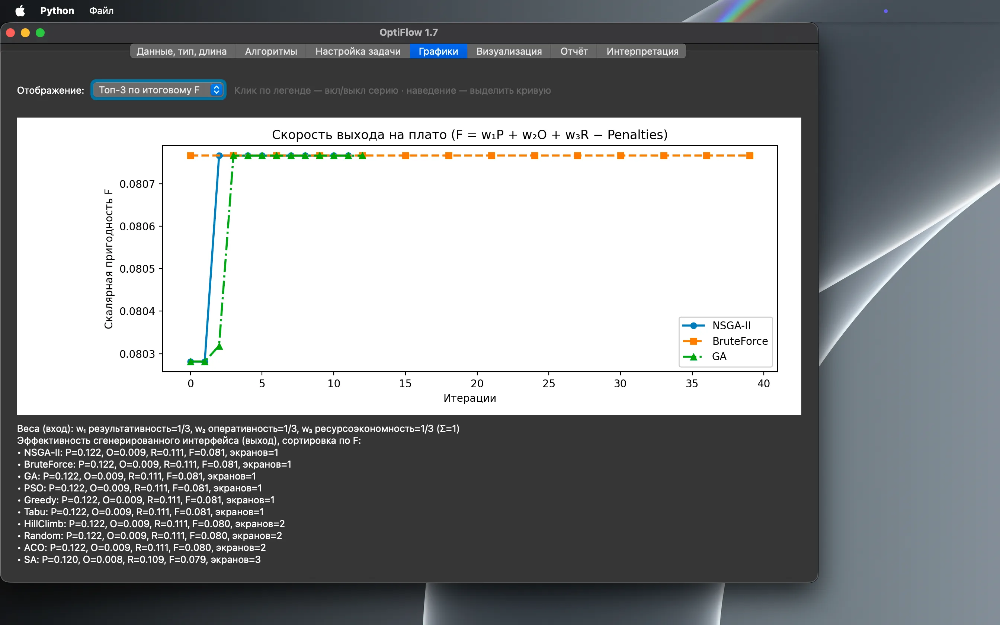
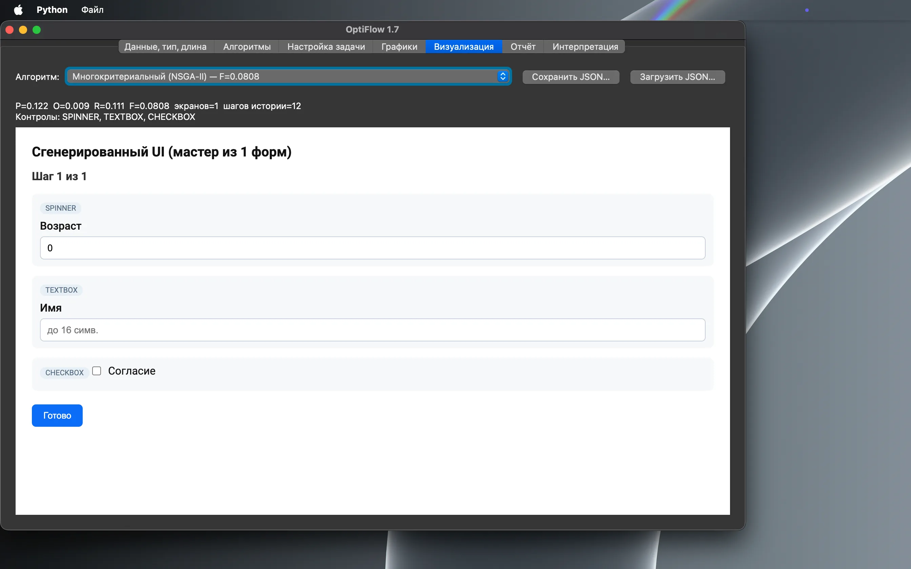
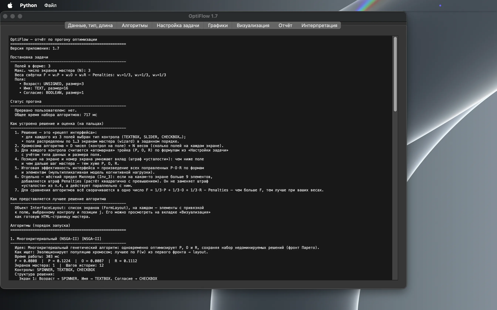
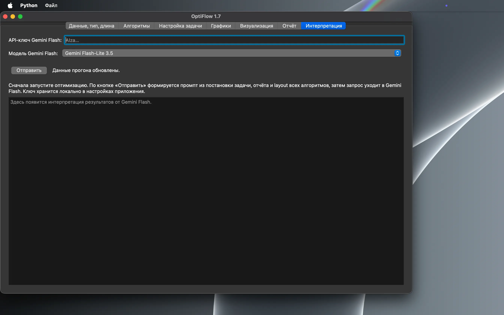

# OptiFlow


> *OptiFlow: PyQt5 framework for multi-step UI/wizard combinatorial synthesis via metaheuristics (NSGA-II, GA, PSO, SA, ACO) and multiplicative cognitive scoring model.*

**OptiFlow** — программный комплекс для автоматизированного синтеза многошаговых графических интерфейсов (wizard): дискретный подбор типов UI-контролов и разбиение полей данных по экранам мастера с оценкой по модели когнитивной эффективности.

Специальность: **2.3.1 «Системный анализ, управление и обработка информации»**.

---

## Научный базис

### Мультипликативная модель эффективности (Kurta–Izrailov, 2025)

Вектор атомарной эффективности элемента интерфейса:

$$
E = \langle P,\ O,\ R \rangle,
$$

где \(P\) — результативность (*Potency*), \(O\) — оперативность (*Operativeness*), \(R\) — ресурсоэкономность (*Resource-saving*).

Суммарная эффективность компоновки вычисляется **мультипликативно** (модель накопления психоэмоционального напряжения, ПЭН):

$$
E_{\mathrm{Total}} = \prod (\mathrm{Corrected\ Forms}) \times \prod (\mathrm{Double\text{-}Corrected\ Elements}).
$$

Коррекции зависят от позиции элемента на форме (\(j\)) и номера шага мастера (\(i\)).

### Скалярная свёртка для оптимизации

Для сравнения алгоритмов и однокритериальной оптимизации используется нормированная линейная свёртка со штрафом:

$$
F = w_1 P + w_2 O + w_3 R - \mathrm{Penalties},\quad w_1 + w_2 + w_3 = 1,\quad w_i \ge 0.
$$

### Инвариант Inv_3 — когнитивный предел Миллера

Число элементов \(k_i\) на любом непустом экране компоновки штрафуется при превышении жёсткой границы \(7\pm2=9\):

$$
\mathrm{Penalties} = w_{penalty}\sum_i \max(0,\,k_i-9)^2,
$$

квадратично по превышению — `compute_miller_penalty()` в [`optiflow/optimization/corrections.py`](optiflow/optimization/corrections.py), единообразно применяется в эталонном переборе и во всех метаэвристиках через `ObjectiveEvaluator.scalar_fitness`. Штраф структурно недостижим при \(D>9N\) (число полей больше суммарной ёмкости экранов) — в этом случае GUI и headless-режим показывают предупреждение с конкретными числами, не блокируя синтез. Отображаемое пользователю и экспортируемое значение \(F\) приведено к \([0,1]\) (`clip_fitness_for_display`); нескорректированный скаляр, которым алгоритмы сравнивают решения, остаётся доступен как `raw_fitness` в отчётах и JSON.

### Эмпирические функции \(P, O, R\)

Атомарные показатели контролов задаются эмпирическими функциями по данным Курта П.А. (2024) — реестр `KURTA_2024_CONTROL_FUNCTIONS`, конфигурация [`task_settings.json`](task_settings.json) (`optiflow-task-settings` v2).

---

## Архитектура

| Компонент | Назначение |
|-----------|------------|
| `optiflow/models/scoring.py` | Типы данных, layout wizard, `FunctionRegistry`, расчёт \(P,O,R\) |
| `optiflow/models/layout_io.py` | JSON синтезированного wizard (`optiflow-interface-layout`) |
| `optiflow/optimization/algorithms.py` | Метаэвристики, `CriterionWeights`, `calculate_fitness()`, `clip_fitness_for_display()` |
| `optiflow/optimization/corrections.py` | Штраф Inv_3 (`compute_miller_penalty`), проверка достижимости (`miller_feasibility_warning`), мультипликативные ПЭН-коррекции |
| `optiflow/optimization/runner.py` | Suite-прогон алгоритмов, контроль времени/итераций |
| `optiflow/benchmarks.py` | Monte Carlo-бенчмарк, Precision Rate vs Brute Force |
| `optiflow/ui/` | HTML-генератор, отчёты, интерпретация Gemini |
| `optiflow/app.py` | PyQt5 GUI и Headless CLI fallback |

**Постановка задачи:** для \(D\) полей выбрать тип контрола и разбиение по \(N\) экранам мастера. Хромосома: \(D\) генов контролов + \(N\) весов разбиения.

**Допустимые контролы:**

| `DataType` | Контролы | Параметр «Размер» |
|------------|----------|-------------------|
| `BOOLEAN` | `CHECKBOX` | фиксирован \(=1\) |
| `UNSIGNED` | `SPINNER`, `SLIDER` | диапазон \(\Delta\) |
| `TEXT` | `TEXTBOX`, `DROPDOWNLIST` | длина строки / число пунктов |

### Поддерживаемые алгоритмы оптимизации

| Алгоритм | Ключ | Роль |
|----------|------|------|
| NSGA-II | `NSGA-II` | Многокритериальный поиск по Парето-фронту |
| Classic GA | `GA` | Однокритериальная эволюция по \(F\) |
| Brute Force | `BruteForce` | **Ground Truth** — исчерпывающий перебор (лимит 50 000 комбинаций) |
| PSO | `PSO` | Алгоритм роя частиц |
| Simulated Annealing | `SA` | Имитация отжига |
| Tabu Search | `Tabu` | Поиск с запретами |
| ACO | `ACO` | Муравьиный алгоритм |
| Hill Climbing | `HillClimb` | Локальный поиск |
| Greedy | `Greedy` | Жадный подбор |
| Random Search | `Random` | Случайный поиск |

Suite запускается последовательно из GUI (вкладка «Алгоритмы» → «Запустить»).

---

## Интерфейс















**Вкладки (v1.7):** Данные → Алгоритмы → Настройка задачи → Графики → Визуализация → Отчёт → Интерпретация.

На вкладке «Данные» сценарий «Баланс» задаёт точные веса \(w_1=w_2=w_3=1/3\); именованные сценарии — «Упор на результативность / оперативность / ресурсоэкономность», без привязки к частным организациям. Синтезированный мастер сохраняется и открывается повторно как JSON (`optiflow-interface-layout`) с вкладки «Визуализация» или из меню «Файл».

**Конфигурация:**

| Файл / экспорт | Формат | Содержимое |
|----------------|--------|------------|
| [`task_settings.json`](task_settings.json) | `optiflow-task-settings` v2 | `control_functions`, `algorithm_limits` |
| Экспорт с вкладки «Данные…» | `optiflow-problem-data` v1 | `fields`, `max_forms`, `weights` |
| Экспорт с вкладки «Визуализация» | `optiflow-interface-layout` v1 | синтезированный wizard: поля, контролы, экраны |

---

## Быстрый старт

```bash
git clone <repository-url>
cd OptiFlow
python3 -m venv .venv
source .venv/bin/activate          # Windows: .venv\Scripts\activate
pip install -r requirements.txt
```

### GUI

```bash
python3 -m optiflow.app
```

Альтернатива после `pip install -e .`: `optiflow-app`.

### Headless CLI

При отсутствии PyQt5 приложение автоматически переключается в консольный режим:

```bash
python3 -m optiflow.app
# PyQt5 not found. Running headless CLI mode...
```

Результат: `wizard_output.html`, при бенчмарке — `benchmark_report.md`.

**Зависимости:** PyQt5, PyQtWebEngine, certifi, numpy, matplotlib — см. [`requirements.txt`](requirements.txt).

---

## Бенчмарки и воспроизводимость (Reproducibility)

### Unit-тесты

```bash
python3 -m unittest discover -s tests -v
```

Проверяются: Brute Force (Ground Truth), Classic GA, нормировка весов, JSON layout, Monte Carlo-бенчмарк, штраф Inv_3 и его достижимость (`MillerConstraintTests`, `RealisticMillerConvergenceTests`, `MillerInfeasibilityTests`, `MillerFeasibilityWarningTests`), клиппинг \(F\) для отображения (`FitnessDisplayClippingTests`), регрессия `aco()` на больших пространствах (`AcoInv3RegressionTests`).

### Monte Carlo-отчёт

```bash
python3 -c "import logging; from pathlib import Path; from optiflow.benchmarks import run_optimization_benchmark; logging.basicConfig(level=logging.INFO); run_optimization_benchmark(runs_count=100, random_seed=42, output_dir=Path('.'), log_markdown=True)"
```

Генерируется `benchmark_report.md` с метриками **Precision Rate** и скорости сходимости относительно Brute Force. Monte Carlo намеренно ограничен \(D\le 4\), чтобы Brute Force оставался вычислимым.

### Эксперимент \(T_{cpu}(M)\) / \(\Delta E\) / `constraint_pass_rate` (главы 4–5)

```bash
python3 scripts/run_dissertation_experiments.py --repeats 10
```

Прогоняет полный ансамбль (`run_optimization_suite`) на \(M\in\{5,10,20,50,100\}\) полях (\(N=\lceil M/9\rceil\), Inv_3 структурно достижим) плюс одну заведомо Inv_3-невыполнимую точку. Сырые данные и сводка — [`docs/dissertation/experiments/`](docs/dissertation/experiments/); там же зафиксировано окружение прогона и авторское допущение о базовой компоновке \(S_0\) (в проекте формально не определена).

Подробности — [`TESTING_GUIDE.md`](TESTING_GUIDE.md).

---

## Цитирование (Citation)

При использовании OptiFlow или воспроизведении экспериментов укажите:

```bibtex
@article{kurta_izrailov_2025_optiflow,
  title={Сведение задачи проектирования графических интерфейсов к оптимизационной},
  author={Курта, П. А. and Израилов, К. Е.},
  year={2025}
}
```

```bibtex
@article{kurta_2024_atomic_efficiency,
  title={Система статистического измерения атомарной эффективности графических элементов интерфейсов},
  author={Курта, П. А.},
  journal={Труды учебных заведений связи},
  volume={10},
  number={6},
  pages={99--110},
  year={2024}
}
```

---

## Литература

1. Курта П.А., Израилов К.Е. Сведение задачи проектирования графических интерфейсов к оптимизационной. 2025.
2. Курта П.А. Система статистического измерения атомарной эффективности графических элементов интерфейсов // Труды учебных заведений связи. 2024. Т. 10. № 6. С. 99–110.

---

## Лицензия

[MIT License](LICENSE) © 2025 Pavel Kurta
