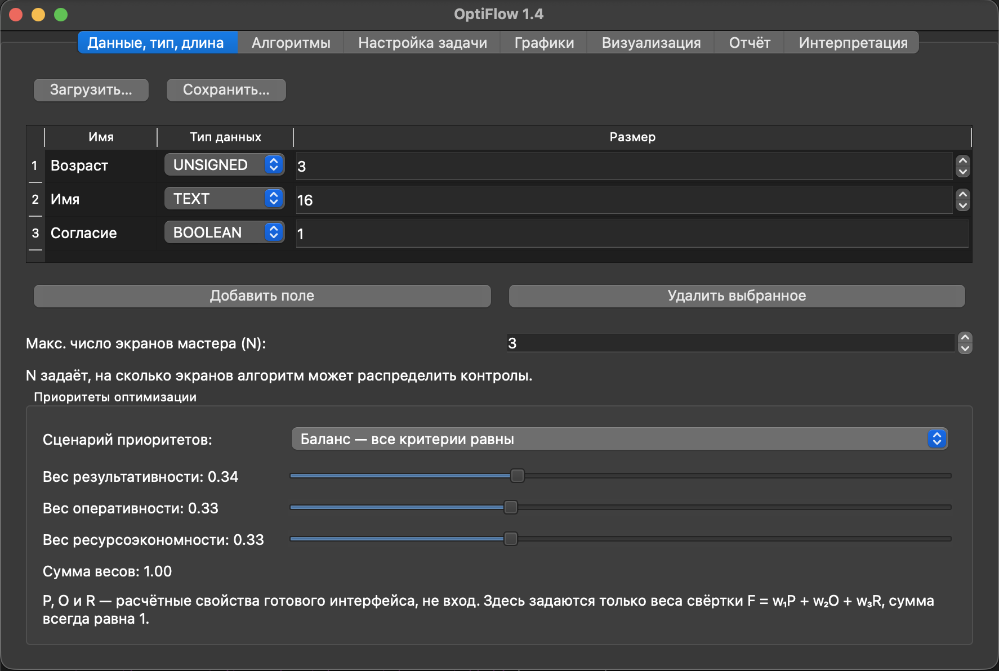
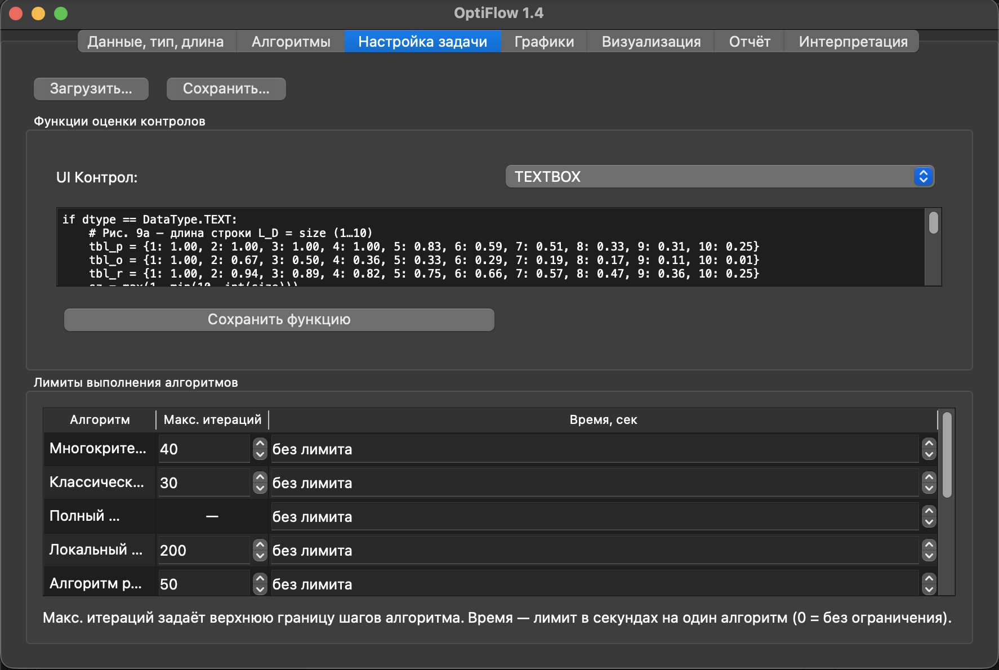

# OptiFlow

## Скриншоты




## Запуск

1. Активируйте виртуальное окружение:
   * **Для macOS/Linux:**
     ```bash
     source .venv/bin/activate
     ```
   * **Для Windows (Command Prompt):**
     ```cmd
     .venv\Scripts\activate.bat
     ```
   * **Для Windows (PowerShell):**
     ```powershell
     .venv\Scripts\Activate.ps1
     ```

2. Запустите приложение:
   ```bash
   python3 -m optiflow.app
   ```

## Тестирование

Быстрая проверка качества оптимизационного движка (из корня репозитория, с активированным `.venv`):

```bash
# Unit-тесты: Brute Force, Classic GA, Monte Carlo-бенчмарк
python3 -m unittest tests.test_benchmarks -v
```

Полный Monte Carlo-бенчмарк (100 прогонов, отчёт `benchmark_report.md`):

```bash
python3 -c "import logging; from pathlib import Path; from optiflow.benchmarks import run_optimization_benchmark; logging.basicConfig(level=logging.INFO); run_optimization_benchmark(runs_count=100, random_seed=42, output_dir=Path('.'), log_markdown=True)"
```

Подробное руководство по метрикам, порогам качества и интерпретации отчётов — в [`TESTING_GUIDE.md`](TESTING_GUIDE.md).

## История версий

### v1

- PyQt-приложение с вкладками: «Данные, тип, длина», «Настройка задачи», «Алгоритмы», «Графики».
- Ползунки коэффициентов всегда нормализуют веса до суммы 1.
- Реестр функций для оценки контролов с безопасным `exec`; заданы разумные дефолты для всех контролов.
- Алгоритмы: NSGA-II (многокритериальный), hill climbing (локальный поиск на дискретном пространстве), PSO и случайный поиск; графики сравнивают лучшую историю скоринга.
- Экспорт в HTML для выбранного/лучшего набора контролов.

### v1.1

- Расширен набор алгоритмов: жадный подбор (Greedy), имитация отжига (SA), поиск с запретами (Tabu), муравьиный алгоритм (ACO) — все сравниваются на графике и сохраняют лучший набор контролов.
- Интерфейс выбора алгоритма переименован и теперь показывает свои параметры динамически (NSGA-II, Hill Climb, PSO, Random, SA, Tabu, ACO); для невыбранных алгоритмов используются их дефолты из схемы.
- Экспорт HTML учитывает новые алгоритмы и выбирает лучший результат с приоритетом выбранного.

### v1.2

Масштабное архитектурное обновление, переводящее проект на строгую научную основу и новую модель оптимизации многошаговых интерфейсов.

#### Научный базис и формулы (Scientific Background)

Начиная с версии 1.2, OptiFlow строго реализует математическую модель из научной статьи:
**«Сведение задачи проектирования графических интерфейсов к оптимизационной» (Курта П.А., Израилов К.Е., 2025)**.

В основе оценки лежит целевой вектор эффективности:

$$
E = \langle P, O, R \rangle,
$$

где:

- \(P\) — **результативность** (*Potency*);
- \(O\) — **оперативность** (*Operativeness*);
- \(R\) — **ресурсоэкономность** (*Resource-saving*).

Ключевой принцип оптимизатора — переход от усреднения к мультипликативной модели. Общая эффективность вычисляется не как среднее арифметическое, а как произведение корректированных показателей:

$$
E_{\mathrm{Total}} = \prod (\mathrm{Corrected\ Forms}) \times \prod (\mathrm{Double\text{-}Corrected\ Elements})
$$

Физический смысл этой формулировки: мультипликативный подход позволяет корректно моделировать накопление когнитивной усталости пользователя (ПЭН) и поэтапную деградацию качества взаимодействия, когда каждый следующий шаг интерфейса влияет на итоговую эффективность сильнее, чем при линейном усреднении.

#### Архитектурные изменения в v1.2

- **Многошаговая архитектура (Wizard).** Выполнен переход от плоского списка элементов к динамическим многоэкранным формам. Хромосома алгоритма теперь декомпозирует интерфейс на хронологические шаги (\(N\) форм) с линейными переходами «Далее/Назад».
- **Двухступенчатый конвейер коррекции.** Внедрены математические функции экспоненциального затухания, накладывающие штраф на элементы интерфейса в зависимости от вертикальной позиции на форме (индекс \(j\)) и номера хронологического шага (индекс \(i\)).
- **Целевые профили (Target Profiles / Pareto).** Усреднение по весам заменено на профили Парето-отсечения: `Макс.`, `Целевое`, `Любое`. Ползунки в UI теперь изолируют отдельные компоненты для максимизации (например, «Результативность» для банковских приложений или «Оперативность» для систем реагирования на ЧС).
- **Консольный режим (Headless CLI Fallback).** Реализована защита импортов PyQt5. При отсутствии графической среды (например, на сервере) приложение автоматически переключается в консольный цикл оптимизации и генерирует итоговый файл `wizard_output.html`.
- **Улучшенный HTML-экспорт.** Генерируемая веб-страница содержит изолированные теги `<section>` и встроенный JavaScript для точной симуляции реального пошагового интерфейса, синтезированного алгоритмом.

### v1.3

Расширение оптимизационного ядра эталонным перебором, однокритериальным GA и автоматизированной валидацией качества.

- **Полный перебор (Brute Force).** Исчерпывающий поиск глобального максимума скалярной пригодности по всем комбинациям контролов и разбиений мастера; используется как Ground Truth для QA (лимит 50 000 комбинаций).
- **Классический генетический алгоритм (GA).** Однокритериальная оптимизация по `scalar_fitness_from_triple()` с турнирным отбором, SBX-кроссовером и гауссовой мутацией на хромосоме \(D + N\).
- **Monte Carlo-бенчмарк.** Модуль `optiflow/benchmarks.py` и unit-тесты `tests/test_benchmarks.py` сравнивают NSGA-II, GA, PSO, Greedy, SA, Tabu, ACO с эталоном Brute Force; метрики: Precision Rate, скорость сходимости, удержание Certain-ограничений `TargetProfile`.
- **Интеграция в UI.** Brute Force и Classic GA добавлены в выпадающий список алгоритмов PyQt5, участвуют в графиках сравнения и экспорте HTML.
- **Headless CLI.** После генерации `wizard_output.html` автоматически формируется сокращённый отчёт `benchmark_report.md`.
- **Документация QA.** Руководство [`TESTING_GUIDE.md`](TESTING_GUIDE.md) с командами запуска и критериями приёмки (например, GA ≥ 95% точности относительно Brute Force).

### v1.4

- Версия продукта вынесена в `optiflow.__version__` и отображается в заголовке окна, например `OptiFlow 1.4`.

## Настройка и использование

Функции для контролов редактируются во вкладке «Настройка задачи». Поля и размеры задаются в «Данные, тип, длина», параметры оптимизации и профили выбираются во вкладке «Алгоритмы», сравнение результатов доступно в «Графики», а экспорт выполняется через меню «Файл → Экспорт веб-страницы».

