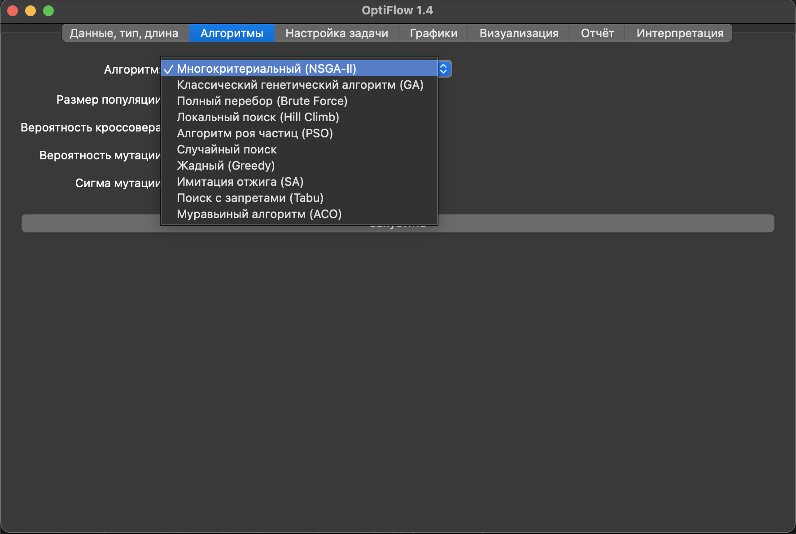
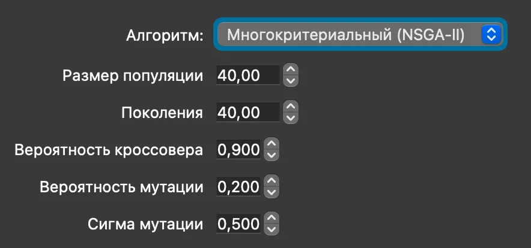
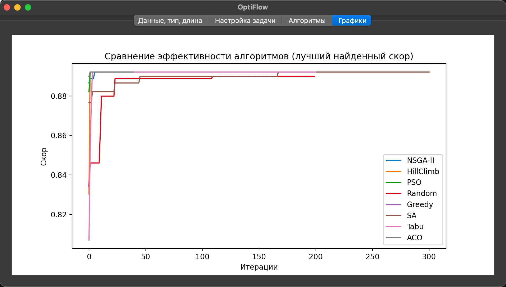
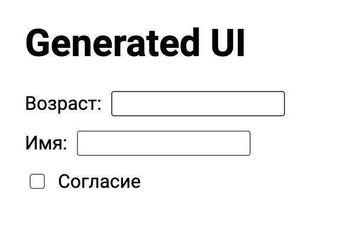
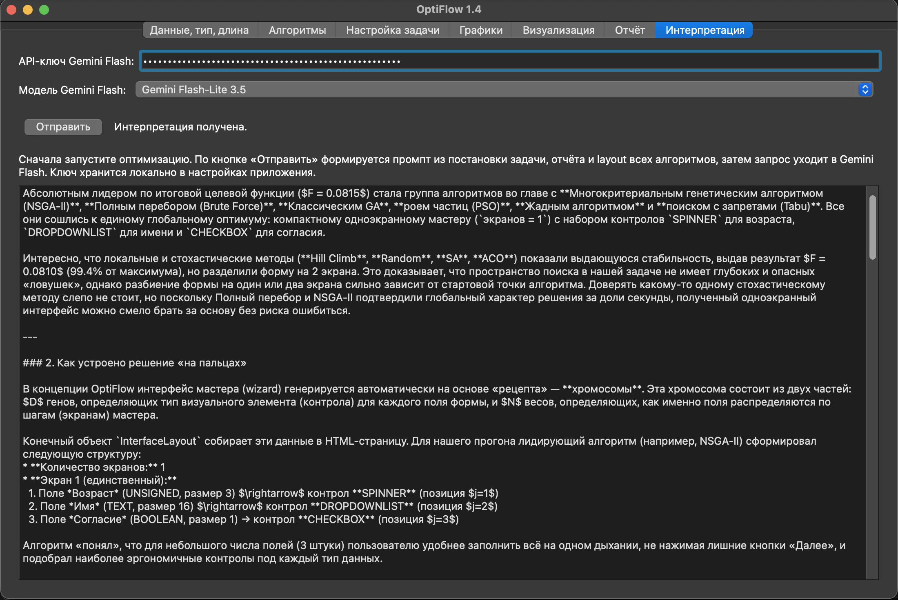

# OptiFlow 1.4

**OptiFlow** — PyQt5-приложение для автоматизированного проектирования многошаговых пользовательских интерфейсов (wizard): подбор типов UI-контролов для полей данных и оптимальное разбиение полей по экранам мастера с помощью набора метаэвристик.

Научная основа: мультипликативная модель эффективности Kurta–Izrailov (2025) и эмпирические функции атомарной эффективности \(P, O, R\) по данным Курта П.А. (2024).

---

## Скриншоты

Положите файлы в каталог [`docs/screenshots/`](docs/screenshots/) в формате **WebP** (рекомендуется) или PNG. Имена файлов и содержание кадров:

| Файл | Вкладка / сцена | Что должно быть видно |
|------|-----------------|------------------------|
| `optyflow01.webp` | **Данные, тип, длина** | Таблица полей (имя, тип, размер), пресет весов \(w_1, w_2, w_3\), число экранов мастера \(N\), кнопки «Сохранить/Загрузить» JSON |
| `optyflow02.webp` | **Алгоритмы** | Выбор алгоритма, параметры, кнопка **«Запустить»** |
| `optyflow03.webp` | **Настройка задачи** | Редактор Python-функций \(P, O, R\) для контрола, таблица лимитов итераций/времени, кнопки «Сохранить/Загрузить» `task_settings.json` |
| `optyflow04.webp` | **Графики** | Фильтр «Топ-3 / Все», кривые с разными стилями/маркерами, сводка \(F, P, O, R\) |
| `optyflow05.webp` | **Визуализация** | Выпадающий список алгоритмов по \(F\) и предпросмотр HTML-мастера в браузере |
| `optyflow06.webp` | **Отчёт** | Текстовый отчёт: идея алгоритма, время, layout «на пальцах» |
| `optyflow07.webp` | **Интерпретация** | Поле API-ключа Gemini, выбор модели, фрагмент сгенерированной интерпретации |

Текущие вставки в README (обновите файлы или замените пути после съёмки):













---

## Требования и установка

- Python 3.10+
- macOS / Linux / Windows

```bash
python3 -m venv .venv
source .venv/bin/activate          # Windows: .venv\Scripts\activate
pip install -r requirements.txt
```

Зависимости UI: **PyQt5**, **PyQtWebEngine** (вкладка «Визуализация»), **certifi** (HTTPS для Gemini), **numpy**, **matplotlib**.

---

## Запуск

```bash
python3 -m optiflow.app
```

Заголовок окна: `OptiFlow 1.4`. Альтернатива после `pip install -e .`: команда `optiflow-app`.

---

## Рабочий процесс (v1.4)

После запуска пройдите вкладки **слева направо**:

1. **Данные, тип, длина** — определите поля (`BOOLEAN` / `UNSIGNED` / `TEXT`), параметр «Размер» (\(L_D\) для текста, диапазон \(\Delta\) для чисел, число пунктов для списка), максимум экранов мастера \(N\) и нормированные веса \(w_1+w_2+w_3=1\) (пресеты или слайдеры). Постановку можно сохранить/загрузить в JSON (`optiflow-problem-data` v1).

2. **Алгоритмы** — выберите метаэвристику и нажмите **«Запустить»**. Запускается **полный прогон** всех алгоритмов suite с оверлеем прогресса; прогон можно **прервать**. По завершении активируется вкладка «Визуализация».

3. **Настройка задачи** — редактируйте Python-код расчёта атомарных \(P, O, R\) для каждого типа контрола; задайте **лимиты итераций и времени** для каждого алгоритма. Готовый набор функций — в [`task_settings.json`](task_settings.json) (формат `optiflow-task-settings` v2, источник: Курта, 2024).

4. **Графики** — сравнение **скорости выхода на плато** \(F\): по умолчанию топ-3 алгоритма, разные стили линий и маркеры, клик/наведение по легенде; финальные \(P, O, R, F\) — в таблице под графиком.

5. **Визуализация** — выбор результата по убыванию \(F\) и интерактивный HTML-предпросмотр мастера (`QWebEngineView`).

6. **Отчёт** — детерминированный текстовый отчёт: стратегия поиска, время работы, структура layout, объяснение скоринга.

7. **Интерпретация** — запрос к **Gemini Flash** (API-ключ Google AI): развёрнутый UX- и методический разбор прогона, в том числе реконструкция того, как каждый алгоритм искал решение. Модели: Gemini Flash 3.7, Flash-Lite 3.5.

**Экспорт:** меню **Файл → Экспорт веб-страницы** — HTML-мастер для выбранного в выпадающем списке алгоритма (или лучшего по \(F\) при fallback).

### Допустимые контролы по типу поля

| Тип данных | Допустимые контролы | Примечание |
|------------|---------------------|------------|
| `BOOLEAN` | `CHECKBOX` | «Размер» фиксирован = 1 |
| `UNSIGNED` | `SPINNER`, `SLIDER` | «Размер» = диапазон \(\Delta\) |
| `TEXT` | `TEXTBOX`, `DROPDOWNLIST` | «Размер» = длина строки / число пунктов |

---

## Конфигурационные файлы

| Файл | Формат | Содержимое |
|------|--------|------------|
| `task_settings.json` | `optiflow-task-settings` v2 | `control_functions` (Python-строки \(P,O,R\)), `algorithm_limits`, ссылка на источник Курта 2024 |
| Экспорт с вкладки «Данные…» | `optiflow-problem-data` v1 | `fields`, `max_forms`, `weights`, `weight_preset` |

Загрузка/сохранение — кнопками на соответствующих вкладках.

---

## Вкладка «Графики»: читаемость при наложении кривых

Когда несколько алгоритмов быстро сходятся к одному \(F\), сплошные линии одной толщины сливаются. В OptiFlow 1.4 на вкладке **«Графики»** применены следующие UX-приёмы:

| Приём | Зачем |
|-------|--------|
| **Тройная кодировка серии** | У каждой кривой свой **цвет + стиль линии** (сплошная / пунктир / штрих / точка) + **маркер** — плато остаётся различимым даже при совпадении \(F\) |
| **Фильтр «Топ-3 по F»** (по умолчанию) | Снижает визуальный шум; режим **«Все алгоритмы»** — для полного оверлея |
| **Клик по легенде** | Включает/выключает серию |
| **Наведение на легенду** | Выделяет одну кривую, остальные приглушаются |
| **Заголовок «Скорость выхода на плато»** | График отвечает на вопрос «как быстро сходились», а не «кто выше», когда финалы совпали |
| **Сводка под графиком** | Точные \(P, O, R, F\) и число экранов — без визуального джиттера метрик |

Практика съёмки скриншота `optyflow04.webp`: после прогона оставьте режим **«Топ-3»** или переключите на **«Все»**, если нужно показать полный набор стилей линий.

---

## Тестирование

Быстрая проверка качества оптимизационного движка (из корня репозитория, с активированным `.venv`):

```bash
# Unit-тесты: Brute Force, Classic GA, Monte Carlo-бенчмарк
python3 -m unittest tests.test_benchmarks -v
```

Полный Monte Carlo-бенчмарк (100 прогонов, отчёт `benchmark_report.md`):

```bash
python3 -c "import logging; from pathlib import Path; from optiflow.benchmarks import run_optimization_benchmark; logging.basicConfig(level=logging.INFO); run_optimization_benchmark(runs_count=100, random_seed=42, output_dir=Path('.'), log_markdown=True)"
```

Подробное руководство по метрикам, порогам качества и интерпретации отчётов — в [`TESTING_GUIDE.md`](TESTING_GUIDE.md).

---

## История версий

### v1

- PyQt-приложение с вкладками: «Данные, тип, длина», «Настройка задачи», «Алгоритмы», «Графики».
- Ползунки коэффициентов всегда нормализуют веса до суммы 1.
- Реестр функций для оценки контролов с безопасным `exec`; заданы разумные дефолты для всех контролов.
- Алгоритмы: NSGA-II (многокритериальный), hill climbing (локальный поиск на дискретном пространстве), PSO и случайный поиск; графики сравнивают лучшую историю скоринга.
- Экспорт в HTML для выбранного/лучшего набора контролов.

### v1.1

- Расширен набор алгоритмов: жадный подбор (Greedy), имитация отжига (SA), поиск с запретами (Tabu), муравьиный алгоритм (ACO) — все сравниваются на графике и сохраняют лучший набор контролов.
- Интерфейс выбора алгоритма переименован и теперь показывает свои параметры динамически (NSGA-II, Hill Climb, PSO, Random, SA, Tabu, ACO); для невыбранных алгоритмов используются их дефолты из схемы.
- Экспорт HTML учитывает новые алгоритмы и выбирает лучший результат с приоритетом выбранного.

### v1.2

Масштабное архитектурное обновление, переводящее проект на строгую научную основу и новую модель оптимизации многошаговых интерфейсов.

#### Научный базис и формулы (Scientific Background)

Начиная с версии 1.2, OptiFlow строго реализует математическую модель из научной статьи:
**«Сведение задачи проектирования графических интерфейсов к оптимизационной» (Курта П.А., Израилов К.Е., 2025)**.

В основе оценки лежит целевой вектор эффективности:

$$
E = \langle P, O, R \rangle,
$$

где:

- \(P\) — **результативность** (*Potency*);
- \(O\) — **оперативность** (*Operativeness*);
- \(R\) — **ресурсоэкономность** (*Resource-saving*).

Ключевой принцип оптимизатора — переход от усреднения к мультипликативной модели. Общая эффективность вычисляется не как среднее арифметическое, а как произведение корректированных показателей:

$$
E_{\mathrm{Total}} = \prod (\mathrm{Corrected\ Forms}) \times \prod (\mathrm{Double\text{-}Corrected\ Elements})
$$

Физический смысл этой формулировки: мультипликативный подход позволяет корректно моделировать накопление когнитивной усталости пользователя (ПЭН) и поэтапную деградацию качества взаимодействия, когда каждый следующий шаг интерфейса влияет на итоговую эффективность сильнее, чем при линейном усреднении.

#### Архитектурные изменения в v1.2

- **Многошаговая архитектура (Wizard).** Выполнен переход от плоского списка элементов к динамическим многоэкранным формам. Хромосома алгоритма теперь декомпозирует интерфейс на хронологические шаги (\(N\) форм) с линейными переходами «Далее/Назад».
- **Двухступенчатый конвейер коррекции.** Внедрены математические функции экспоненциального затухания, накладывающие штраф на элементы интерфейса в зависимости от вертикальной позиции на форме (индекс \(j\)) и номера хронологического шага (индекс \(i\)).
- **Целевые профили (Target Profiles / Pareto).** *(заменены в v1.4 на нормированные веса \(w_1, w_2, w_3\))* Усреднение по весам заменено на профили Парето-отсечения: `Макс.`, `Целевое`, `Любое`.
- **Консольный режим (Headless CLI Fallback).** Реализована защита импортов PyQt5. При отсутствии графической среды (например, на сервере) приложение автоматически переключается в консольный цикл оптимизации и генерирует итоговый файл `wizard_output.html`.
- **Улучшенный HTML-экспорт.** Генерируемая веб-страница содержит изолированные теги `<section>` и встроенный JavaScript для точной симуляции реального пошагового интерфейса, синтезированного алгоритмом.

### v1.3

Расширение оптимизационного ядра эталонным перебором, однокритериальным GA и автоматизированной валидацией качества.

- **Полный перебор (Brute Force).** Исчерпывающий поиск глобального максимума скалярной пригодности по всем комбинациям контролов и разбиений мастера; используется как Ground Truth для QA (лимит 50 000 комбинаций).
- **Классический генетический алгоритм (GA).** Однокритериальная оптимизация по `calculate_fitness()` (\(F = w_1 P + w_2 O + w_3 R\)) с турнирным отбором, SBX-кроссовером и гауссовой мутацией на хромосоме \(D + N\).
- **Monte Carlo-бенчмарк.** Модуль `optiflow/benchmarks.py` и unit-тесты `tests/test_benchmarks.py` сравнивают NSGA-II, GA, PSO, Greedy, SA, Tabu, ACO с эталоном Brute Force; метрики: Precision Rate и скорость сходимости относительно \(F(w)\).
- **Интеграция в UI.** Brute Force и Classic GA добавлены в выпадающий список алгоритмов PyQt5, участвуют в графиках сравнения и экспорте HTML.
- **Headless CLI.** После генерации `wizard_output.html` автоматически формируется сокращённый отчёт `benchmark_report.md`.
- **Документация QA.** Руководство [`TESTING_GUIDE.md`](TESTING_GUIDE.md) с командами запуска и критериями приёмки (например, GA ≥ 95% точности относительно Brute Force).

### v1.4

Комплексное обновление UX, эмпирической базы скоринга и анализа результатов.

#### Модель и скоринг

- Версия продукта в `optiflow.__version__`, отображается в заголовке окна (`OptiFlow 1.4`).
- Скалярная пригодность: **\(F = w_1 P + w_2 O + w_3 R\)** при **\(w_1+w_2+w_3=1\)** — пресеты сценариев и связанные слайдеры на вкладке «Данные…».
- **Эмпирические функции \(P, O, R\)** по Курта П.А. (2024): табличные значения для `TEXTBOX` (Рис. 9a), `DROPDOWNLIST` (Рис. 9b), `CHECKBOX` (Табл. 4.4), дифференцированные `SPINNER` / `SLIDER`, `TEXTBOX_RO`. Единый реестр `KURTA_2024_CONTROL_FUNCTIONS` и файл [`task_settings.json`](task_settings.json) (формат v2).

#### Интерфейс и workflow

- Порядок вкладок: **Данные → Алгоритмы → Настройка задачи → Графики → Визуализация → Отчёт → Интерпретация**.
- **Асинхронный прогон suite** всех алгоритмов: оверлей прогресса, пошаговый статус, **отмена** прогона.
- Лимиты **итераций и времени** перенесены на вкладку «Настройка задачи» (таблица по алгоритмам).
- Поле `BOOLEAN`: размер зафиксирован **1**, колонка «Размер» только для чтения.
- **JSON:** экспорт/импорт постановки задачи (`optiflow-problem-data`) и настроек (`optiflow-task-settings`).

#### Результаты и анализ

- **Графики** — тройная кодировка серий (цвет / linestyle / marker), фильтр топ-3 vs все, клик и hover по легенде; акцент на скорости сходимости к плато \(F\).
- **Визуализация** — `QWebEngineView`, выбор алгоритма по \(F\), предпросмотр HTML-мастера.
- **Отчёт** — модуль `optiflow/ui/run_results.py`: идея алгоритма, время работы, layout, объяснение скоринга «на пальцах».
- **Интерпретация** — интеграция **Gemini Flash** (API Google AI): детальный разбор прогона и реконструкция стратегии поиска каждого алгоритма; SSL через `certifi`.
- **HTML-генератор:** корректная отрисовка `SPINNER`, `TEXTBOX`, `DROPDOWNLIST`, русские подписи.

#### Зависимости

- Добавлены **PyQtWebEngine**, **certifi** (`requirements.txt`, `setup.py`).

---

## Литература

1. Курта П.А., Израилов К.Е. Сведение задачи проектирования графических интерфейсов к оптимизационной // … 2025.
2. Курта П.А. Система статистического измерения атомарной эффективности графических элементов интерфейсов // Труды учебных заведений связи. 2024. Т. 10. № 6. С. 99–110.
