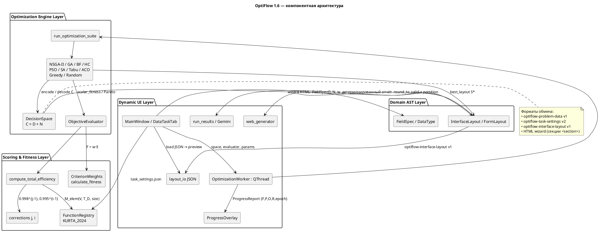

# Программно-аналитический аудит комплекса OptiFlow

**Объект:** программный прототип структурно-параметрического синтеза многошаговых графических интерфейсов (wizard) OptiFlow, версия **1.6**.  
**Назначение документа:** синхронизация рукописи диссертации (специальность 2.3.1) с фактической реализацией; материал для § 5.2–5.7 и готовый текст § 5.4.  
**Метод:** сплошной анализ исходных модулей `optiflow/`, конфигураций `task_settings.json`, контрактов JSON и тестового контура `tests/`, `optiflow/benchmarks.py`.  
**Дата среза кодовой базы:** 2 сентября 2026 г.

В отчёте фиксируется **реализованное** поведение. Там, где теоретические сущности рукописи (\(G_S\), \(G_D\), \(g_{rls}\), адаптивный селектор) **не имеют программного носителя**, это указано явно, без подмены желаемой модели кодом.

> **Обновление от 16.09.2026.** После среза кодовой базы (2.09.2026) инвариант Inv_3 (когнитивный предел Миллера) реализован как штрафное ограничение в целевой функции \(F\) — см. врезку в конце раздела 2.3 и обновлённый раздел 4.1. Остальной текст отчёта, включая архитектурную декомпозицию, ансамбль метаэвристик и матрицы \(M_{elem}\), соответствует состоянию на дату среза и правкой не затронут.

---

## Раздел 1. Актуальная архитектура и модульная декомпозиция прототипа (к § 5.4)

### 1.1. Сопоставление модулей с каноническими слоями

Прототип организован как четырёхслойный конвейер «спецификация задачи → оценка \(E=\langle P,O,R\rangle\) → метаэвристический поиск → материализация FormLayout». Графы сценариев \(G_S\) и данных \(G_D\) как самостоятельные структуры **отсутствуют**: топология сценария сведена к линейному мастеру из не более чем \(N\) экранов; порядок полей совпадает с порядком входа \(D_{in}\).

| Канонический слой | Реализующие модули | Фактический контракт |
|---|---|---|
| **Domain AST Layer** | `optiflow/models/scoring.py`: `DataType`, `ControlType`, `FieldSpec`, `LayoutElement`, `FormLayout`, `InterfaceLayout`; построение `build_interface_layout`, `build_interface_layout_from_partition` | Поле ввода: имя, \(T_D\in\{\mathrm{BOOLEAN},\mathrm{UNSIGNED},\mathrm{TEXT}\}\), параметр размера. Решение: упорядоченный список экранов с элементами \((d_j, V_j, j)\). **Нет** AST графов \(G_S\), \(G_D\), нет гена правил валидации |
| **Scoring & Fitness Layer** | `FunctionRegistry`, `KURTA_2024_CONTROL_FUNCTIONS`; `compute_total_efficiency`; `CriterionWeights`, `calculate_fitness`; коррекции `optiflow/optimization/corrections.py` | Атомарная тройка \(M_{elem}(V,T_D,\mathrm{size})\) исполняется как изолированный `exec` эмпирического кода. Итог \(E_{Total}\) — покомпонентное произведение. Скаляр \(F=w_1P+w_2O+w_3R\) |
| **Optimization Engine Layer** | `DecisionSpace`, `ObjectiveEvaluator`; ансамбль в `algorithms.py`; оркестрация `runner.run_optimization_suite` | Хромосома длины \(D+N\). Suite из 10 методов запускается **последовательно**, без адаптивного выбора по \(\dim(C)\) |
| **Dynamic UI Layer** | `optiflow/app.py` (PyQt5); `optiflow/ui/web_generator.py`; `optiflow/models/layout_io.py`; `optiflow/ui/run_results.py` | HTML-мастер; JSON постановки (`optiflow-problem-data`), настроек (`optiflow-task-settings`), синтезированного layout (`optiflow-interface-layout`); отчёт и LLM-интерпретация |

Входной слой GUI (`DataTaskTab`) формирует список `FieldSpec` и прикрепляет `allowed_controls()` по \(T_D\). Это единственный источник допустимого алфавита \(V\) для оптимизатора. Класс `TEXTBOX_RO` присутствует в реестре функций, но **не входит** в `allowed_controls()` и потому не принадлежит пространству поиска.

### 1.2. PlantUML: компонентная диаграмма и потоки данных



**Потоки вызовов (основной контур синтеза).**  
`MainWindow.run_algorithms` → `DecisionSpace(fields, max_forms)` + `ObjectiveEvaluator(registry, weights)` → `OptimizationWorker.run` → `run_optimization_suite` (цикл по `SUITE_STEPS`) → для каждой метаэвристики `decode_layout` / `scalar_fitness` → `best_layout` → `_on_suite_finished` → графики, HTML-предпросмотр, отчёт, контекст интерпретации.

**Форматы обмена.**

| Формат | Версия | Содержимое |
|---|---|---|
| `optiflow-problem-data` | 1 | `fields`, `max_forms`, `weights`, `weight_preset` |
| `optiflow-task-settings` | 2 | `control_functions`, `algorithm_limits`, метаданные источника Курта 2024 |
| `optiflow-interface-layout` | 1 | поля, экраны, контролы, метрики \(P,O,R,F\), веса свёртки |

### 1.3. Таблица трассировки теоретических сущностей

| Теоретическая сущность | Реализующий класс / структура | Путь |
|---|---|---|
| Вектор входа \(D_{in}\), типы \(T_D\) | `FieldSpec`, `DataType` | `optiflow/models/scoring.py` |
| Класс элемента \(V_j\) | `ControlType`; алфавит — `allowed_controls()` | `scoring.py`; привязка в `optiflow/app.py`, `optiflow/benchmarks.py` |
| Граф сценария \(G_S\) | **Не реализован.** Линейный мастер \(i=1,\ldots,k\le N\) | — |
| Граф данных \(G_D\) | **Не реализован как граф.** Порядок полей фиксирован входом; назначение на экраны — композиция \(D\) по \(N\) корзинам | `DecisionSpace._partition_counts_from_genome`, `partition_counts_to_form_indices` |
| \(E=\langle P,O,R\rangle\) | `EfficiencyTriple` (клиппинг \([0,1]\), произведение покомпонентно) | `optiflow/models/scoring.py` |
| \(M_{elem}(V,T_D)\) | `FunctionRegistry.evaluate_atomic`; таблицы `KURTA_2024_CONTROL_FUNCTIONS`; дублирование в `task_settings.json` | `scoring.py`; `task_settings.json` |
| Коррекции позиции \(j\) и шага \(i\) (модель ПЭН) | `apply_element_position_correction`, `apply_form_step_correction` | `optiflow/optimization/corrections.py` |
| Мультипликативная свёртка компоновки | `compute_total_efficiency` | `optiflow/optimization/algorithms.py` |
| Скаляр \(F\) и веса \(w\) | `CriterionWeights`, `calculate_fitness` | `algorithms.py` |
| Хромосома \(C\) | `numpy.ndarray` длины \(D+N\); декод `DecisionSpace.decode_layout` | `algorithms.py` |
| Решение \(S\) (layout) | `InterfaceLayout` / `FormLayout` / `LayoutElement` | `scoring.py` |
| Экспорт \(S\) | `generate_html_from_layout`; `interface_layout_to_payload` | `optiflow/ui/web_generator.py`; `optiflow/models/layout_io.py` |

---

## Раздел 2. Математическая формализация дискретного генома и инвариантов (к § 5.2 и § 5.3)

### 2.1. Программное представление интерфейса и хромосомы \(C\)

Теоретический вектор \(C=\langle g_{frs},\, g_{cr},\, g_{rls}\rangle\) в коде **не хранится трёхкомпонентно**. Реализован двухсегментный геном (комментарий в `DecisionSpace`):

\[
C = \bigl(c_1,\ldots,c_D,\; \pi_1,\ldots,\pi_N\bigr)\in\mathbb{R}^{D+N},\qquad \dim(C)=D+N,
\]

где \(D=|D_{in}|\) — число полей, \(N=\max(1,\texttt{max\_forms})\) — верхняя граница числа экранов.

**Сегмент \(g_{cr}\) (класс элемента ввода).**  
Гены \(c_d\in[0,\,|V(d)|-1]\). Декодирование: округление и клиппинг `round_to_valid` → индекс в `field.allowed_controls()`. Соответствие \(T_D\mapsto V\):

| \(T_D\) | Допустимые \(V\) в поиске | \(\lvert V(d)\rvert\) |
|---|---|---|
| `BOOLEAN` | `CHECKBOX` | 1 |
| `UNSIGNED` | `SPINNER`, `SLIDER` | 2 |
| `TEXT` | `TEXTBOX`, `DROPDOWNLIST` | 2 |

**Сегмент \(g_{frs}\) (номер экранной формы).**  
Не кодируется как независимый индекс формы для каждого поля (что дало бы \(N^D\) назначений). Реализована **последовательная композиция**: вещественные веса \(\pi_n\ge 0\) нормируются на симплекс, масштабируются на \(D\) и методом наибольших остатков превращаются в целый вектор \((k_1,\ldots,k_N)\) с \(\sum k_n=D\), \(k_n\ge 0\). Затем первые \(k_1\) полей (в исходном порядке) попадают на форму 0, следующие \(k_2\) — на форму 1, и т.д. Пустые корзины при сборке `InterfaceLayout` **отбрасываются**; фактическое число экранов \(k\le N\), индексы \(i\) перенумеровываются с 1.

Следствие: перестановка полей между экранами **без нарушения входного порядка** невозможна. Это сужает \(\Omega\) относительно полной модели «каждое поле — любая форма», но автоматически сохраняет линейный порядок \(D_{in}\).

**Сегмент \(g_{rls}\) (правила валидации).**  
**Отсутствует в геноме.** Ограничения HTML (`maxlength`, `min`/`max` спиннера и ползунка, число пунктов списка) выводятся детерминированно из `FieldSpec.size` в `web_generator.py` и **не оптимизируются**.

Позиция элемента \(j\) на экране — не ген, а следствие порядка внутри корзины (1-based `position_index`).

### 2.2. Мощность пространства поиска \(\lvert\Omega\rvert\)

Дискретное пространство, перечисляемое brute force:

\[
\lvert\Omega\rvert
=
\Biggl(\prod_{d=1}^{D} \lvert V(d)\rvert\Biggr)
\cdot
\binom{D+N-1}{N-1}.
\]

Первый множитель — декартово произведение алфавитов контролов; второй — число неотрицательных целочисленных решений \(\sum_{n=1}^{N} k_n=D\) (композиции, «звёзды и перегородки»), функция `brute_force_search_space_size`.

**Пример постановки по умолчанию GUI** (\(D=3\): UNSIGNED, TEXT, BOOLEAN; \(N=3\)): \(\lvert V\rvert=2\cdot 2\cdot 1=4\), \(\binom{5}{2}=10\), \(\lvert\Omega\rvert=40\).

Исчерпывающий перебор выполняется только при \(\lvert\Omega\rvert\le 50\,000\) (`BRUTE_FORCE_MAX_COMBINATIONS`); иначе `brute_force` возбуждает `ValueError`, suite сохраняет пустой layout и предупреждение в UI.

Непрерывная релаксация \(C\in\mathbb{R}^{D+N}\) используется GA/NSGA-II/PSO/SA/HC; дискретизация всегда через `round_to_valid`.

### 2.3. Инварианты Inv_1, Inv_2, Inv_3

| Инвариант | Смысл в рукописи | Реализация | Механизм обеспечения |
|---|---|---|---|
| **Inv_1** функциональная полнота \(D_{in}\) | каждое поле ввода представлено ровно один раз | Да. Декод строит `form_indices` длины \(D\); сумма счётчиков \(=D\); при загрузке JSON — запрет дубликатов `field_index` и проверка покрытия всех индексов | **Конструктивная репарация (repair)** при декодировании; валидация с отказом при импорте JSON. Штраф **не** применяется |
| **Inv_2** топологический порядок потоков | согласованность с \(G_D\) | Частично. Порядок полей **заморожен**; направленность — только вперёд по экранам мастера. Произвольный DAG \(G_D\) и ветвления \(G_S\) **не моделируются** | Ограничение кодирования (последовательная нарезка). Фильтрации особей нет |
| **Inv_3** когнитивный предел Миллера \(k_i\le 7\pm 2\) | жёсткая ёмкость экрана | **Реализован как штрафное ограничение (обновление 16.09.2026).** См. врезку ниже | Аддитивный штраф в \(F\), единообразно применяемый в эталонном переборе и во всех метаэвристиках |

> **Обновление 16.09.2026 — реализация Inv_3.** В `optiflow/optimization/corrections.py` добавлены константы `MILLER_SOFT_LIMIT=7`, `MILLER_TOLERANCE=2`, `MILLER_HARD_LIMIT=9` и функция `compute_miller_penalty(layout, penalty_weight, hard_limit)`, вычисляющая штраф \(\mathrm{Penalties}=w_{penalty}\sum_i \max(0,\,k_i-9)^2\) по всем непустым экранам компоновки (квадратичный рост выбран, чтобы сильные нарушения подавлялись быстрее умеренных). `ObjectiveEvaluator` (`algorithms.py`) получил параметр `penalty_weight` (по умолчанию `DEFAULT_MILLER_PENALTY_WEIGHT=0.01`); `scalar_fitness` теперь вычисляет штраф по фактическому layout и передаёт его в `calculate_fitness` вместо ранее захардкоженного `penalties=0`. Поскольку `brute_force` и все десять метаэвристик вызывают `evaluator.scalar_fitness`, штраф действует единообразно во всём ансамбле; отдельно скорректирован `nsga2`, который ранее пересчитывал финальный скаляр в обход `ObjectiveEvaluator`. Отображение \(F\) в отчётах и GUI (`run_results.py`, `app.py`) также приведено в соответствие. Модульные тесты (`tests/test_benchmarks.py::MillerConstraintTests`) проверяют корректность формулы, её единообразный проброс и согласованность `brute_force`/`nsga2` с `evaluator.scalar_fitness`.
>
> **Открытые вопросы, требующие проверки перед финальной формулировкой в рукописи [Требуется авторское уточнение]:**
> 1. Не подтверждено эмпирически на реалистичном \(D\) (порядка 15–20 полей), что штраф с `penalty_weight=0.01` действительно изменяет итоговый `best_layout`, а не остаётся пренебрежимо малым на фоне диапазона \(E\); текущие тесты проверяют корректность формулы и согласованность путей расчёта, но не итоговое поведение оптимизатора на больших постановках.
> 2. Ограничение Inv_3 структурно невыполнимо при \(D > 9N\) (число полей превышает суммарную ёмкость всех \(N\) экранов) — в этом случае штраф остаётся положительным независимо от найденного решения. Требуется явная проверка этого условия в `DecisionSpace`/GUI и/или соответствующая оговорка в тексте метода (границы применимости Inv_3), иначе формулировка «инвариант обеспечивается» будет неточной за пределами \(D\le 9N\).

Параметр `penalties` функции `calculate_fitness` (унаследовано из версии до 16.09.2026) был предусмотрен изначально, но до указанной даты `ObjectiveEvaluator.scalar_fitness` **всегда** вызывал её с `penalties=0`; штрафные функции за нарушение Inv_1–Inv_3 в рабочем контуре не были задействованы. Это описание сохранено как историческая фиксация состояния на дату среза (2.09.2026); текущее состояние — во врезке выше. Отбор особей по недопустимости по-прежнему не производится напрямую: все векторы после `round_to_valid` считаются допустимыми в смысле Inv_1, а несоблюдение Inv_3 теперь отражается исключительно через штраф в \(F\), а не через отсев.

---

## Раздел 3. Вычислительное ядро и реализация метаэвристик (к § 5.3 и § 5.5)

Оркестратор `run_optimization_suite` выполняет **фиксированную последовательность** из десяти методов (`SUITE_STEPS`). Адаптивного селектора «метод \(=f(\dim C)\)» **нет**.

### 3.1. Ансамбль алгоритмов

**Стохастический локальный поиск (`hill_climb`).**  
Старт — случайный \(C\). На каждой внешней итерации — покоординатный просмотр: для генов контролов шаги \(\pm 1\) в целочисленной шкале индекса \(V\); для весов разбиения — \(\pm 0.2\). Принимается только улучшение \(F\). Останов: отсутствие улучшения по всем координатам либо лимит итераций (по умолчанию 200). **Случайных рестартов (SHC-RR) нет** — это восхождение в одну вершину, а не мультистартовый SHC.

**Имитация отжига (`simulated_annealing`).**  
Сосед: случайная координата; контрол \(\pm 1\), вес разбиения \(\sim U[-0,25;0,25]\). Критерий приёма при максимизации \(F\):

\[
\Delta = F(C')-F(C),\qquad
\text{принять, если }\Delta>0\text{ или }U(0,1)<\exp\bigl(\Delta / \max(\varepsilon,T)\bigr).
\]

Это схема Метрополиса для **максимизации** (знак \(\Delta\) противоположен классической минимизации энергии). Температурное расписание — **геометрическое (экспоненциальное охлаждение)** \(T\leftarrow T\cdot \rho\) с \(\rho=0{,}97\), \(T_0=5{,}0\), 300 итераций. **Расписание Коши** \(T\sim T_0/k\) и **больцмановское** \(T\sim T_0/\ln k\) **не реализованы**.

**Классический ГА (`classic_genetic_algorithm`).**  
Популяция 30, поколений 30. Селекция — **турнир размера 3** по скаляру \(F\). Кроссовер — **SBX** (Deb, Agrawal, 1995), \(\eta=15\), вероятность 0,9 **по гену**. Мутация — независимый гауссов шум с \(\sigma=0{,}5\) на сегменте контролов и увеличенной \(\sigma\) на сегменте разбиения; клиппинг в границы генома. Смена поколения — **элитизм \((\mu+\lambda)\)**: объединение родителей и потомков, отбор \(\mu\) лучших по \(F\). Рулетка **не** используется.

**NSGA-II (`nsga2`).**  
Популяция 40, поколений 40. Цели — максимизация \((P,O,R)\) (доминирование: \(\ge\) по всем компонентам и \(>\) хотя бы по одной). Селекция — бинарный турнир по рангу Парето и crowding distance. Кроссовер — **арифметическое смешивание** \(c=\alpha p_1+(1-\alpha)p_2\), \(\alpha\sim U(0,1)^d\), **не** SBX. Мутация — изотропный гауссов вектор с вероятностью 0,2. Элитизм — отбор нового поколения с фронтов недоминирования. Для сравнения алгоритмов из фронта \(F_1\) берётся особь с максимальным \(F(w)\); с 16.09.2026 этот финальный пересчёт скаляра учитывает штраф Inv_3 наравне с `ObjectiveEvaluator.scalar_fitness` (см. врезку в разделе 2.3).

**Полный перебор (`brute_force`).**  
Декартово произведение индексов \(V\) и всех композиций \((k_1,\ldots,k_N)\). Эталон Ground Truth при \(\lvert\Omega\rvert\le 50\,000\).

**Жадный (`greedy`).**  
1) последовательный выбор наилучшего контрола поля при фиксированном одноэкранном разбиении; 2) локальные переносы единицы счётчика между формами, пока \(F\) растёт. Глобальный оптимум не гарантируется.

**PSO (`pso`).**  
Каноническое обновление скорости с инерцией 0,7, cognitive 1,5, social 1,5; рой 30, 50 итераций. Позиции декодируются тем же `round_to_valid`.

**Поиск с запретами (`tabu_search`).**  
Окрестность: смена контрола поля или перенос одного поля между формами. Запрет хода \((i,v)\) или \((1000+n_{from}, n_{to})\) на tenure 7, кроме улучшающего глобальный рекорд (aspiration).

**Муравьиный алгоритм (`aco`).**  
Феромон и эвристика — **только на выборе \(V_d\)**. Эвристика — \(F\) одноэкранной пробной компоновки с данным контролом. Разбиение на экраны каждый муравей семплирует случайно. Испарение \(0{,}1\), депозит пропорционален \(F\) лучшего муравья итерации. Это ACO по дискретной части генома, а не полный муравьиный поиск по \(\Omega\).

> **Обновление 16.09.2026 — переклассификация и устранение сбоя `aco()` на больших пространствах.** Ранее наблюдавшееся падение `np.random.choice` с ошибкой `probabilities are not non-negative` на больших \(D\) с полями TEXT/UNSIGNED **ошибочно классифицировалось как независимый от Inv_3 численный дефект**. Диагностика (инструментированный прогон с логированием феромона и эвристики непосредственно перед падением) показала обратное: причина — **побочный эффект штрафа Inv_3**, обнаруживается в двух местах `aco()`, оба неявно предполагали \(F\ge 0\), что всегда выполнялось до появления штрафа: 1) эвристика — это \(F\) пробной компоновки, где **все** \(D\) полей помещены на один экран независимо от фактического \(N\), поэтому штраф Inv_3 срабатывает уже при \(D>9\) вне зависимости от исхода задачи, а \(\eta=\text{эвристика}^\beta\) не сохраняет ранжирование кандидатов при отрицательных значениях (более отрицательная эвристика при возведении в чётную степень может дать *большее* \(\eta\), чем менее отрицательная); 2) депозит феромона \(\tau\mathrel{+}=w_{dep}\cdot F^*\) при постоянно отрицательном \(F^*\) (структурно невыполнимое пространство, \(D>9N\)) монотонно накапливает вычитания и уводит феромон в отрицательную область, после чего \(\tau^\alpha\) даёт отрицательную вероятность, не отсекаемую проверкой суммы `np.sum(probs)<=0` (сумма по строке может остаться положительной за счёт других контролов). Исправление точечное: (а) эвристика построчно (на каждое поле) нормируется в строго положительный, монотонный (ранг-сохраняющий) диапазон **только если** в строке есть отрицательное значение — `optiflow/optimization/algorithms.py::_rank_preserving_positive_heuristic_row`; (б) депозит клиппингуется снизу нулём — `deposit_weight * max(0.0, iteration_best)` — вместо добавления сырого отрицательного значения. `compute_miller_penalty`, `ObjectiveEvaluator` и сравнение решений внутри `aco()` (выбор лучшего муравья, `best_layout`) не изменены — используется по-прежнему нескорректированный (потенциально отрицательный) \(F\). Тесты — `tests/test_benchmarks.py::AcoInv3RegressionTests`.

**Случайный поиск (`random_search`).**  
200 независимых выборок `random_vector`.

**Меметические гибриды (GA+LS)** в кодовой базе **не выделены**.

### 3.2. Адаптивная селекция метаэвристики

Программный выбор метода в зависимости от \(\dim(C)\) **отсутствует**. Пользователь задаёт лимиты итераций/поколений в таблице «Настройка задачи»; suite исполняет все ключи подряд. При отмене (`OptimizationControl.cancelled`) цикл suite прерывается, уже полученные \(S^*\) по завершённым алгоритмам сохраняются.

### 3.3. Псевдокод главного цикла (стандарт изложения ВАК)

```
Вход: D_in = {FieldSpec_d}, N, w на симплексе, реестр M_elem, параметры suite
Выход: {S*_a, F*_a, история F_a} для алгоритмов a ∈ A

1. Построить пространство решений Ω: C ∈ R^{D+N}, декод Δ: C ↦ InterfaceLayout
2. Задать оценщик Φ(S) = compute_total_efficiency(S; M_elem, коррекции j,i)
          F(S) = w1 Φ_P + w2 Φ_O + w3 Φ_R − Penalties(S)  // Penalties = compute_miller_penalty
3. Для каждого a ∈ A в фиксированном порядке:
   3.1. Инициализировать популяцию / точку C согласно a
   3.2. Пока не исчерпан ресурс итераций a и не подан сигнал останова:
        — породить допустимые C' (операторы a);
        — S' ← Δ(C');  // репарация Inv_1
        — вычислить Φ(S'), F(S');
        — обновить архив лучшего S*_a;
        — зафиксировать телеметрию (эпоха, F, P, O, R)
   3.3. Сохранить S*_a
4. Вернуть набор решений для сравнительного анализа
```

Оператор \(\Delta\) есть `DecisionSpace.decode_layout` (округление + композиция \(D\) по \(N\)).

---

## Раздел 4. Аудит целевой функции и матриц метрик (к § 5.2 и § 5.7)

### 4.1. Программная свёртка и расчёт \(P,O,R\)

Скалярная пригодность:

\[
F = w_1 P + w_2 O + w_3 R - \mathrm{Penalties},\qquad
w_i\ge 0,\; w_1+w_2+w_3=1.
\]

**С 16.09.2026** \(\mathrm{Penalties}=\texttt{compute\_miller\_penalty}(S)=w_{penalty}\sum_i\max(0,k_i-9)^2\) вычисляется по фактической компоновке \(S\) и применяется единообразно в `brute_force` и во всех метаэвристиках (детали — врезка в разделе 2.3). До этой даты в рабочих вызовах оптимизатора было \(\mathrm{Penalties}\equiv 0\); это состояние более не актуально.

Компоненты \(P,O,R\) решения \(S\) — координаты \(E_{Total}\):

\[
E_{Total}
=
\prod_{i=1}^{k}
\Bigl(
E_{form}(k_i)\circ \delta_i
\Bigr)
\times
\prod_{i=1}^{k}
\prod_{j=1}^{k_i}
\Bigl(
\bigl(M_{elem}(V_{ij},T_{d(ij)},s_{ij})\circ \delta_j\bigr)\circ \delta_i
\Bigr),
\]

где \(\circ\) — покомпонентное умножение троек; \(k\) — число непустых экранов после декода.

- Атомарная форма: \(E_{form}(m)=\langle 0{,}999^m,\, 0{,}999^m,\, 0{,}995^m\rangle\) (`evaluate_form`).  
- Коррекция позиции \(j\) (1-based): \(\delta_j=0{,}998^{\max(0,j-1)}\) на все три координаты.  
- Коррекция шага мастера \(i\): \(\delta_i=0{,}995^{\max(0,i-1)}\). Элемент корректируется **дважды** по \(i\) (после позиции) — «double-corrected elements» в комментарии к уравнению (1).

Это программная модель накопления психоэмоционального напряжения (ПЭН): рост \(m\), \(j\) и \(i\) **мультипликативно уменьшает** вклад — этот механизм остался нетронутым и действует **параллельно** штрафу Inv_3, а не вместо него. Разграничение: мультипликативные коэффициенты моделируют постепенное утомление оператора при любом \(m\); аддитивный штраф Inv_3 отдельно наказывает превышение жёсткой ёмкости экрана \(k_i>9\).

**Нормировка весов.**  
`CriterionWeights.from_raw` проецирует \((w_1,w_2,w_3)\) на симплекс; нулевой вектор → \((1/3,1/3,1/3)\); прямой конструктор отвергает сумму \(\ne 1\). GUI: ползунки в тиках \(0\ldots 100\) с инвариантом суммы 100 (`redistribute_weight_ticks`); сценарий «Баланс» хранит **точные** \(1/3\) и отображает подписи «1/3», не квантуя к \(0{,}34/0{,}33/0{,}33\). Именованные пресеты: \((0{,}70;0{,}20;0{,}10)\), \((0{,}20;0{,}70;0{,}10)\), \((0{,}20;0{,}10;0{,}70)\).

### 4.2. Источник \(M_{elem}(V,T_D)\) и сверка со статьёй Курта (2024)

Численные матрицы заданы как Python-литералы в `KURTA_2024_CONTROL_FUNCTIONS` (`optiflow/models/scoring.py`) с явной ссылкой: Курта П.А. // Труды учебных заведений связи. 2024. Т. 10. № 6. С. 99–110. Тот же код сериализуется в `task_settings.json` (`optiflow-task-settings` v2, поле `meta_source`) и загружается редактором функций GUI.

Сопоставление с опубликованной эмпирикой (по комментариям в коде — рис. 9a, 9b, табл. 4.4):

| \(V\) | Условие \(T_D\), размер | \(P,O,R\) в коде |
|---|---|---|
| TEXTBOX | TEXT, длина \(L=1\ldots 10\) | табл. рис. 9a, напр. \(L=1\): \((1;1;1)\); \(L=10\): \((0{,}25;0{,}01;0{,}25)\); \(L>10\): линейная экстраполяция |
| DROPDOWNLIST | TEXT или UNSIGNED, \(M=1\ldots 10\) | рис. 9b; \(M=1\): \((1;1;1)\); \(M=10\): \((0{,}33;0{,}07;0{,}01)\) |
| CHECKBOX | BOOLEAN | табл. 4.4: \((0{,}99;0{,}97;0{,}96)\) |
| SPINNER | UNSIGNED, \(\Delta\le 3 / \le 7 / >7\) | \((0{,}96;0{,}90;0{,}91)\), \((0{,}88;0{,}65;0{,}72)\), \((0{,}75;0{,}35;0{,}50)\) |
| SLIDER | UNSIGNED, \(\Delta\le 5 / \le 15 / >15\) | \((0{,}92;0{,}93;0{,}90)\), \((0{,}88;0{,}90;0{,}82)\), \((0{,}84;0{,}85;0{,}75)\) |
| TEXTBOX_RO | TEXT | \((0{,}99;0{,}95;0{,}95)\) — вне \(\Omega\) поиска |
| несогласованная пара \((V,T_D)\) | — | \((0{,}50;0{,}50;0{,}50)\) |

Исполнение — `exec` в песочнице без builtins; при ошибке откат на те же таблицы. Редактирование кода в GUI меняет \(M_{elem}\) без перекомпиляции ядра.

---

## Раздел 5. Телеметрия, асинхронность и тестовые бенчмарки (к § 5.6 и § 5.7)

### 5.1. UI-поток и останов

Тяжёлый suite вынесен в `OptimizationWorker(QThread)`. Прогресс: `OptimizationControl.notify` → сигнал `ProgressReport` (алгоритм, индекс в suite, итерация, \(F\), \(P\), \(O\), \(R\), доля suite) → `ProgressOverlay` (QProgressBar 0…1000, подписи). Интервал эмиссии \(\ge 0{,}05\) с.

Останов: `threading.Event` (`cancel`) и опциональный дедлайн `time_limit_s` на алгоритм. `should_stop` опрашивается в циклах метаэвристик; при обрыве возвращается **текущий** лучший `best_layout` / `best_score` (субоптимум \(S^*\)). Suite при отмене не запускает оставшиеся методы; GUI сохраняет частичные сводки.

Интерпретация Gemini — отдельный `GeminiInterpretWorker(QThread)`, не пересекается с оптимизатором.

### 5.2. Бенчмарки и воспроизводимость

| Контур | Содержание | Где |
|---|---|---|
| Unit-тесты весов и \(F\) | нормировка симплекса, \(1/3\), round-trip тиков, \(F\) с ненулевым penalty | `tests/test_benchmarks.py` |
| Штраф Inv_3 (с 16.09.2026) | формула квадратичного штрафа, согласованность `scalar_fitness`/`calculate_fitness`, согласованность `brute_force`/`nsga2` | `tests/test_benchmarks.py::MillerConstraintTests` |
| Brute Force = Ground Truth | совпадение с независимым перебором на микропространстве | `BruteForceTests` |
| ГА | возврат layout | `ClassicGATests` |
| Останов | Random Search прерывается `OptimizationControl` | `ProgressControlTests` |
| JSON layout | round-trip `optiflow-interface-layout` | `tests/test_layout_io.py` |
| Monte Carlo | случайные \(D\in[2,4]\), \(N\le 3\), Precision Rate относительно BF при \(\lvert\Omega\rvert\le 50\,000\); плато истории \(F\) (patience 3, \(\varepsilon=10^{-6}\)) | `optiflow/benchmarks.py`, `run_optimization_benchmark` |

**Данные, которых в репозитории нет.**  
Прогоны по размерностям \(M\in\{5,10,20,50,100\}\) с таблицами \(T_{cpu}\) и \(\Delta E=E(S^*)-E(S_0)\) **в артефактах не сохранены**. Генератор Monte Carlo намеренно ограничен \(D\le 4\), чтобы brute force оставался вычислимым — поэтому имеющиеся бенчмарки **не покрывают** проверку сходимости к Inv_3-допустимым решениям на реалистичном \(D\) (см. открытый вопрос №1 во врезке раздела 2.3). Поле `constraint_pass_rate` в статистике бенчмарка **не наполняется**. Для глав 4–5 экспериментальные таблицы больших \(M\) необходимо получать отдельной серией прогонов и не атрибутировать их текущему git-срезу.

---

## Раздел 6. Текст для вставки в рукопись: § 5.4

### 5.4. Архитектура и программная реализация комплекса автоматизированного структурно-параметрического синтеза интерфейсов

Для экспериментальной верификации метода структурно-параметрического синтеза интерфейса эргатической системы разработан программный комплекс OptiFlow (версия 1.6), реализующий замкнутый цикл «постановка задачи — оценка вектора атомарной эффективности — метаэвристический поиск на дискретном множестве компоновок — материализация многошагового графического интерфейса». Комплекс построен как четырёхслойная конвейерная архитектура, в которой математические объекты диссертации отображаются на типизированные программные контракты без скрытой эвристики вне явного декодера хромосомы и явной мультипликативной модели эффективности.

На слое предметной спецификации вход эргатической задачи задаётся конечным набором полей ввода \(D_{in}\). Каждое поле описывается тройкой «идентификатор — тип данных \(T_D\) — параметр размера» (`FieldSpec`). Тип \(T_D\) принимает одно из трёх значений: булев признак, неотрицательная величина, текстовый домен. Алфавит допустимых классов элементов ввода \(V\) определяется однозначно по \(T_D\): бинарный выбор реализуется флажком; неотрицательная величина — счётчиком либо ползунком; текстовый домен — строковым полем либо выпадающим списком. Тем самым отображение \(T_D\mapsto V(d)\) является частью постановки, а не свободным параметром поиска. Решение синтеза представляется структурой `InterfaceLayout`: упорядоченной последовательностью экранных форм, на каждой из которых размещены элементы с привязкой к полю, выбранному классу \(V_j\) и позиционным индексом \(j\) (нумерация с единицы). Графы сценария \(G_S\) и данных \(G_D\) в прототипе не выделяются в самостоятельные структуры: сценарий редуцирован к линейному мастеру с числом экранов не более заданного \(N\), а направленность потока данных совпадает с порядком перечисления полей во входе. Указанная редукция сужает класс синтезируемых диалогов, но обеспечивает однозначную интерпретацию решения и воспроизводимость экспериментов.

Слой оценивания реализует вектор атомарной эффективности \(E=\langle P,O,R\rangle\) и его накопление по компоновке. Численные значения \(M_{elem}(V,T_D,s)\) загружаются из реестра эмпирических функций, построенного по результатам статистического измерения атомарной эффективности графических элементов (Курта, 2024) и дублируемого в конфигурации задачи. Для каждого элемента вычисляется тройка \((P,O,R)\in[0,1]^3\); далее применяются позиционная коррекция по месту элемента на форме и коррекция по номеру шага мастера, отражающие модель накопления психоэмоционального напряжения оператора. Итоговая эффективность компоновки определяется как покомпонентное произведение скорректированных вкладов форм и дважды скорректированных вкладов элементов. Сравнение компоновок в однокритериальных процедурах выполняется скаляризованной линейной свёрткой \(F=w_1P+w_2O+w_3R-\mathrm{Penalties}\) на нормированном симплексе весов; многокритериальный поиск сохраняет недоминируемые тройки \((P,O,R)\). Аддитивное слагаемое \(\mathrm{Penalties}\) реализует инвариант когнитивного предела Миллера \(Inv_3\): для каждого непустого экрана компоновки превышение жёсткой границы \(k_i>9\) наказывается штрафом, квадратично растущим с величиной превышения; штраф вычисляется по фактической компоновке и применяется единообразно в эталонном переборе и во всех метаэвристиках ансамбля. Мультипликативные коэффициенты по позиции элемента и номеру шага мастера, моделирующие постепенное накопление психоэмоционального напряжения оператора, действуют параллельно штрафу и не заменяются им: они отражают плавную деградацию эффективности, тогда как штраф — жёсткую границу ёмкости экрана.

Слой оптимизационного ядра задаёт пространство решений хромосомой \(C\in\mathbb{R}^{D+N}\). Первые \(D\) генов кодируют индекс класса элемента в допустимом алфавите поля; оставшиеся \(N\) генов — неотрицательные веса, декодируемые в целочисленную композицию \(D\) полей по \(N\) последовательным экранам. Декодер гарантирует, что каждое поле входит в компоновку ровно один раз (инвариант функциональной полноты) и что порядок полей на мастере совпадает с порядком входа. Независимое назначение поля на произвольный экран и оптимизация правил валидации в хромосому не входят: ограничения ввода в порождаемом HTML выводятся из параметра размера поля. Мощность дискретного множества компоновок равна произведению мощностей алфавитов \(V(d)\) на число композиций \(D\) элементов по \(N\) корзинам; исчерпывающий перебор этого множества используется как эталон глобального максимума \(F\) при мощности не выше \(5\cdot 10^4\) вариантов. [Требуется авторское уточнение: инвариант \(Inv_3\) гарантированно достижим только при \(D\le 9N\); при большем числе полей штраф действует как давление к минимизации превышения ёмкости экрана, но не как гарантия его полного устранения — эта граница применимости метода подлежит явной фиксации в тексте после дополнительной проверки.]

Над указанным пространством реализован ансамбль метаэвристик с единым интерфейсом «вектор \(C\) — декод — \(F\) / \((P,O,R)\)»: многокритериальный генетический алгоритм недоминируемой сортировки, однокритериальный генетический алгоритм с турнирной селекцией и кроссовером SBX, полный перебор, покоординатный локальный поиск, метод роя частиц, случайный поиск, жадная схема, имитация отжига с геометрическим охлаждением и критерием Метрополиса, поиск с запретами, муравьиный алгоритм по дискретной части генома. Оркестратор выполняет методы последовательно в фиксированном порядке; выбор алгоритма как функции размерности хромосомы в прототипе не производится, что соответствует постановке сравнительного эксперимента, а не онлайновой адаптации. Вычислительно затратный прогон ансамбля вынесен в фоновый поток графической оболочки; телеметрия передаёт эпоху, текущие \(P,O,R\) и \(F\); сигнал останова сохраняет достигнутый к моменту прерывания субоптимум.

Слой динамической материализации преобразует `InterfaceLayout` в HTML-мастер с поэлементной разметкой и в машиночитаемый JSON синтезированного решения, допускающий повторную загрузку без повторного поиска. Тем самым комплекс замыкает цепь от формальной постановки структурно-параметрического синтеза до наблюдаемого интерфейса эргатической системы и обеспечивает сопоставимость метаэвристик на общей функции \(F\) и общем декодере \(C\mapsto S\).

**Таблица 5.4.** Сопоставление математических операторов метода с программными модулями комплекса OptiFlow

| Оператор / объект метода | Программный модуль комплекса |
|---|---|
| Спецификация \(D_{in}\), \(T_D\), размера поля | `FieldSpec`, `DataType` (`optiflow/models/scoring.py`); ввод — `DataTaskTab` |
| Алфавит \(V(d)\) | `ControlType` + `allowed_controls()` |
| Компоновка \(S\), экран \(i\), позиция \(j\) | `InterfaceLayout`, `FormLayout`, `LayoutElement` |
| Хромосома \(C=\langle c_{1..D},\,\pi_{1..N}\rangle\), \(\dim C=D+N\) | `DecisionSpace`; декод `decode_layout` / `round_to_valid` |
| Мощность \(\lvert\Omega\rvert\) | `brute_force_search_space_size` |
| Матрица \(M_{elem}(V,T_D,s)\) | `FunctionRegistry`, `KURTA_2024_CONTROL_FUNCTIONS`, `task_settings.json` |
| Коррекции ПЭН по \(j\) и \(i\) | `optiflow/optimization/corrections.py` |
| Штраф \(Inv_3\), \(\mathrm{Penalties}=w_{penalty}\sum\max(0,k_i-9)^2\) | `compute_miller_penalty` (`optiflow/optimization/corrections.py`) |
| \(E_{Total}=\prod E_{form}\times\prod E_{elem}\) | `compute_total_efficiency` |
| Скаляр \(F=w^\top E-\mathrm{Penalties}\), симплекс \(w\) | `CriterionWeights`, `calculate_fitness`, `ObjectiveEvaluator` |
| Эталон \(\arg\max F\) | `brute_force` |
| Метаэвристики на \(C\) | `nsga2`, `classic_genetic_algorithm`, `hill_climb`, `pso`, `simulated_annealing`, `tabu_search`, `aco`, `greedy`, `random_search` |
| Сравнительный прогон ансамбля | `run_optimization_suite` |
| Асинхронность и останов с сохранением \(S^*\) | `OptimizationWorker`, `OptimizationControl` |
| Материализация интерфейса | `generate_html_from_layout`; JSON — `layout_io.py` |

---

## Краткие выводы для согласования глав 4–5 с кодом

1. Прототип реализует **линейный wizard-синтез** с геномом \(D+N\) и мультипликативной моделью \(E=\langle P,O,R\rangle\) по эмпирике Курта (2024), а не полный синтез на графах \(G_S\), \(G_D\).  
2. Инвариант полноты полей обеспечивается **репарацией декодера**; ген валидации **не кодируется**. Предел Миллера (Inv_3) с 16.09.2026 реализован как аддитивный штраф в \(F\) — см. врезку раздела 2.3; ограничение гарантированно достижимо при \(D\le 9N\) [Требуется авторское уточнение по границе применимости].  
3. Ансамбль метаэвристик **шире**, чем минимальный набор HC/SA/GA, но **не содержит** адаптивного селектора по \(\dim C\) и меметических гибридов.  
4. Штраф в \(F\) до 16.09.2026 был **зарезервирован и не использовался** рабочим оценщиком; с указанной даты штраф Inv_3 задействован во всём ансамбле и в эталонном переборе. Когнитивные эффекты плавной деградации (в отличие от жёсткой границы Inv_3) по-прежнему вложены в мультипликативные коэффициенты \(j\) и \(i\), действующие параллельно штрафу.  
5. Воспроизводимый Ground Truth ограничен \(\lvert\Omega\rvert\le 50\,000\); таблицы \(T_{cpu}(M)\) для \(M\in\{5,\ldots,100\}\) требуют отдельного эксперимента вне текущего репозитория. Эмпирическая проверка сходимости к Inv_3-допустимым решениям на реалистичном \(D\) (порядка 15–20) также требует отдельного эксперимента — см. открытый вопрос №1 во врезке раздела 2.3.

*Конец отчёта.*